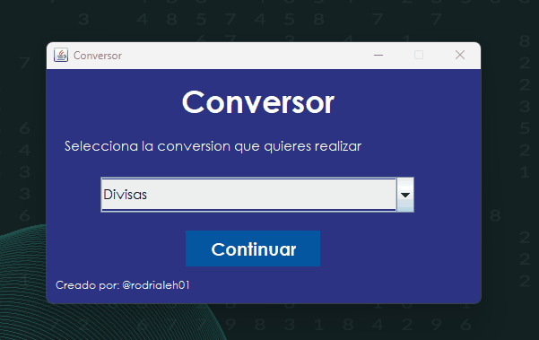

# Conversor
Segundo Challenge de Oracle Next Education.

## ⚙️ Herramientas utilizadas de Desarrollo
- Java Runtime Environment
- Java Development Kit 17
- IDE: IntelliJ IDEA 2023.1.12
- Diseño: Libreria AWT y Swing de Java

## 🤓 Instrucciones de uso
1. Descargar el archivo Conversor.jar
2. Abrir el archivo Conversor.jar (Debe tomar en cuenta tener instalado el Java Runtime Environment)
3. Seleccionar que tipo de conversión desea realizar:
    - De Divisas 🪙
    - De Temperatura 🌡️
    - De Longitud 📏
    - De Masa ⚖️
4. Seleccionar las medidas de conversión
5. Ingresar el valor a convertir
6. Automáticamente le saldra el valor de lado derecho de la ventana

## 🤔 Funcionalidades
### Conversion de Divisas🪙
    - Dolar Estadounidense
    - Euro
    - Quetzal Guatemalteco
    - Won Surcoreano
    - Yen Japones
    - Libras Esterlinas
### Conversion de Temperatura 🌡️
    - Celsius
    - Fahrenheit
    - Kelvin
### Conversion de Longitud 📏
    - Kilometros
    - Metros
    - Pulgadas
    - Pies
    - Millas
    - Yardas
### Conversion de Masa ⚖️
    - Gramos
    - Kilogramos
    - Onzas
    - Libras

## 🎥 Video de demostración

## 📝 Código Fuente

Lo puedes encontrar en el siguiente enlace: [Código Fuente](./Connversor/src/)

## 👤 Contacto
Si quieres compartir alguna observación, comentario o consulta acerca de dicho proyecto o algo relacionado a la programación, puedes escribirme a los siguientes medios: 
- [Linkedin](https://www.linkedin.com/in/rodrialeh01/)
- [Correo Electrónico](mailto:rodrialehdl@gmail.com)
- [Discord](https://discord.com/users/528432917509046302)
